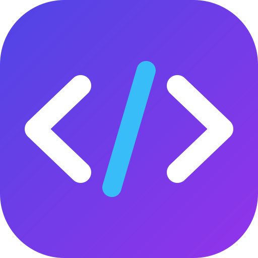

# RenderCraft - 极简代码预览与渲染工作室 (Android & Web)

<p align="center">
  
</p>

<p align="center">
  <strong>专为开发者与移动端打造的超轻量、高流畅度代码即时渲染神器</strong><br>
  一键粘贴 AI（ChatGPT / Claude / DeepSeek）代码，SVG、HTML、XML 即贴即现，支持应用内自动在线升级。
</p>

<p align="center">
  <a href="https://github.com/zhuquan7237/RenderCraft/actions/workflows/build-apk.yml">
    
  </a>
  
  
  
  
</p>

---

## 📖 项目简介与立项初衷

在日常开发与 AI 辅助编程中，我们经常从 ChatGPT、Claude、DeepSeek 或 Gemini 等 AI 对话模型中获取各类前端代码（SVG 矢量图标、HTML/CSS 交互组件、Android VectorDrawable XML、Markdown 文档等）。

**传统痛点：**
- 在手机端没有轻便的代码查看与渲染工具，只能把代码发回电脑上打开浏览器或启动 IDE；
- 多数移动端代码编辑器体积臃肿（50MB~100MB+），自带的 Monaco 或重型 AST 解析器在手机上卡顿发热；
- AI 常常输出带 ````xml` 或 ````html` 的 Markdown 代码框，直接粘贴会破坏解析导致空白。

**RenderCraft 的解决方案：**
**RenderCraft** 是一款专为移动端（Android 手机/平板）与 Web 端设计的轻量化代码渲染工作室。它具备极简的人体工学交互，启动快至毫秒级，智能过滤 AI 标记，让任意代码片段在手机上**即粘即看、即改即现**。

---

## 🌟 核心功能亮点

### 1. 🎨 SVG 矢量图形即时渲染
- **手势缩放与漫游**：支持 20% ~ 400% 自由缩放调节，高刷新率手势平滑顺畅。
- **4 种底色快速切换**：提供透明棋盘格、纯白背景、暗黑夜间底色、工程蓝图网格等多种模式，检验反色与透明通道。
- **色彩自动拾取（Color Palette）**：自动提取 SVG 中用到的 Hex/RGBA 颜色，点击色块即可一键复制色值。
- **高清导出**：支持一键导出 2X 高清 PNG 图片或保存原始 `.svg` 文件。

### 2. 🌐 HTML / CSS / JS 安全沙箱运行
- **安全沙箱环境**：基于隔离式 iframe 沙箱，支持纯前端 CSS 动画、Canvas、JavaScript 交互运行。
- **多端视口切换**：一键切换安卓手机视口 (390px)、平板视口 (768px) 与桌面全屏视口。
- **内置开发者控制台**：无缝拦截并捕获 `console.log`、`console.warn`、`console.error` 与全局 JS 运行时报错，手机上排查脚本一目了然。

### 3. 🤖 Android VectorDrawable XML 自动转译与树形解析
- **Android 原生矢量转译**：自动嗅探 `<vector android:pathData="..." >` 标签，并在无需安装 Android SDK 的情况下将其转换为 SVG 实时可视化呈现。
- **DOM 节点树解析器**：内置可交互折叠的 XML 节点树，直观查看层级嵌套、节点属性与键值。

### 4. ⚡ AI 代码智能清洗与一键直出 (Smart Paste)
- **智能脱壳清洗**：自动剔除 AI 生成内容中的 Markdown 代码围栏（````xml`、````html`、````svg`）与 XML 声明头。
- **格式自动嗅探**：通过语法特征自动判断属于 SVG、HTML、XML、Markdown 还是 JSON。
- **一键极速渲染**：点击「应用到当前并立即渲染」，更新代码与切换预览同步完成。

### 5. 🚀 应用内在线自动检测更新（In-App OTA Updater）
- **实时同步上游**：自动探测 GitHub 上游 Releases 最新版本；当检测到新发布时，界面自动浮现升级提醒。
- **应用内一键下载直升**：在软件内即可点击直接拉取最新 APK 进行覆盖安装，**无需再次访问 GitHub 网页，更无需解拆仓库代码！**
- **手动检查更新**：提供手动轮询按钮，随时获取最新特性与更新日志。

### 6. 📱 真机人体工学设计与防重叠排版
- **单行顶栏标准**：严谨的 54px 单行功能栏，核心功能一触即达，次级功能收入「···」更多菜单，彻底杜绝按钮挤压重叠。
- **真机状态栏 34px 安全隔离**：留出系统时间、电量、前置摄像头挖孔独立避让间距，按键点击毫不别扭。
- **日夜双模式（Dark / Light Theme）**：高对比日光白模式与沉浸式暗黑夜间模式自由切换。

---

## 📥 下载与安装

### 方式一：直接下载预构建 Android APK
您可以直接下载由 GitHub Actions 官方云端构建的原生安装包：
- 📲 **[下载 RenderCraft-v1.0.1.apk (最新正式版)](https://github.com/zhuquan7237/RenderCraft/releases/download/v1.0.1/RenderCraft-v1.0.1.apk)**

> **关于体积说明 (4.6 MB)**：该安装包为标准 Android 原生构建，内置了 AndroidX 核心库、Capacitor 运行时以及全套 CPU 架构（`arm64-v8a`、`armeabi-v7a`、`x86`、`x86_64`）兼容库。对比常规移动端混合框架动辄 40MB~80MB 的体积，4.6 MB 极为小巧。而其中的 Web 核心静态资源压缩后仅约 140 KB。

### 方式二：应用内自动升级
打开已安装的 RenderCraft，右上角点击 **【···】** -> **【在线检查更新】**，发现新版本后点击 **【立即在应用内下载更新】** 即可。

---

## 🛠️ 本地开发与构建指南

本项目基于 **React 19 + TypeScript + Vite + Tailwind CSS + Capacitor 8** 构建。

### 1. 克隆仓库与安装依赖
```bash
git clone https://github.com/zhuquan7237/RenderCraft.git
cd RenderCraft
npm install
```

### 2. 启动本地开发服务
```bash
npm run dev
# 浏览器访问 http://localhost:3000
```

### 3. 编译打包 Web 资源
```bash
npm run build
```

### 4. 同步至 Android 原生工程并在手机上调试
```bash
# 将前端构建产物复制到 Android 原生工程目录
npx cap sync android

# 使用 Android Studio 打开原生工程
npx cap open android
```

---

## 🤖 GitHub Actions 持续集成与云端打包 (CI/CD)

仓库已内置 `.github/workflows/build-apk.yml` 自动化构建工作流：
1. 每当向 `main` 分支执行 `git push` 时，GitHub Actions 会在 Ubuntu 运行器上自动安装 JDK 21、Android SDK Build-Tools 与依赖。
2. 自动化执行 `npm run build`、`npx cap sync android` 与 `./gradlew assembleDebug`。
3. 产出的正式 APK 会作为 Artifacts 与 GitHub Release 自动发布，全自动免除本地配置 Android Studio 与 Gradle 环境的繁琐步骤。

---

## 📂 项目结构概览

```text
RenderCraft/
├── android/                   # Capacitor 托管的完整 Android 原生工程
│   ├── app/
│   │   ├── src/main/AndroidManifest.xml
│   │   └── build.gradle
│   └── build.gradle
├── public/                    # 静态资源、离线工程包与版本配置
│   ├── version.json           # 应用内在线自动检测更新端点
│   ├── icon.svg               # 高清矢量图标与启动标
│   ├── manifest.json          # PWA 配置文件
│   └── RenderCraft-v1.0.0.apk # 预打包直链安装包
├── src/
│   ├── components/            # 核心 UI 模块
│   │   ├── TopAppBar.tsx      # 防重叠单行顶部导航栏与快捷菜单
│   │   ├── BottomNavBar.tsx   # 底部多标签切换栏
│   │   ├── CodeEditor.tsx     # 轻量代码编辑器与行号工具
│   │   ├── RenderPreview.tsx  # 多格式实时渲染与视口画布
│   │   ├── SmartPasteModal.tsx# AI 代码一键捕获清洗弹窗
│   │   ├── UpdateModal.tsx    # 应用内在线自动更新升级面板
│   │   ├── FileListDrawer.tsx # 侧边栏文件管理抽屉
│   │   └── AndroidPhoneFrame.tsx # 真机框架与桌面模拟器
│   ├── context/
│   │   └── ThemeContext.tsx   # 白天 / 黑夜双主题上下文
│   ├── services/
│   │   └── updater.ts         # 上游 Release 自动检测与版本比对逻辑
│   ├── utils/
│   │   ├── codeDetect.ts      # AI 标记清洗与代码格式自动识别
│   │   ├── androidXmlToSvg.ts # Android VectorDrawable 转 SVG 算法
│   │   └── templates.ts       # 初始示例模板 (SVG/HTML/XML)
│   ├── App.tsx                # 应用根组件与全视口伸缩布局
│   └── main.tsx               # 入口挂载
├── package.json               # 项目包配置 (rendercraft v1.0.1)
└── README.md                  # 项目官方说明文档
```

---

## 📄 开源许可证

本项目基于 [Apache License 2.0](LICENSE) 开源协议发布，欢迎 Fork、Star 与提交 Pull Request！
